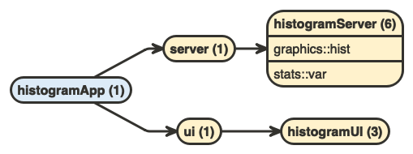
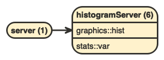

<!-- README.md is generated from README.Rmd. Please edit that file -->

# shiny.histogram

An example of shiny app that we can use `flow::flow_view_shiny()` on.

The minimal app is taken straight from Hadley Wickham’s “Mastering
Shiny” with minor modifications.

## Installation

Install with:

``` r
devtools::install_github("moodymudskipper/shiny.histogram")
```

Though you might be better off cloning the repo or reproducing from code
below to understand the process.

## Code

That’s all the package contains :

``` r
# app --------------------------------------------------------------------------

#' @export
histogramApp <- function() {
  shinyApp(ui, server)
}

# main ui function -------------------------------------------------------------

ui <- function() {
  fluidPage(
    histogramUI("hist1")
  )
}

# main server function ---------------------------------------------------------

server <- function(input, output, session) {
  histogramServer("hist1")
}

# module -----------------------------------------------------------------------

histogramUI <- function(id) {
  tagList(
    selectInput(NS(id, "var"), "Variable", choices = names(mtcars)),
    numericInput(NS(id, "bins"), "bins", value = 10, min = 1),
    plotOutput(NS(id, "hist"))
  )
}

histogramServer <- function(id) {
  moduleServer(id, function(input, output, session) {
    data <- reactive(mtcars[[input$var]])
    output$hist <- renderPlot({
      hist(data(), breaks = input$bins, main = input$var)
    }, res = 96)
  })
}
```

## Use flow::flow_view_shiny()

``` r
library(shiny.histogram) # or devtools::load_all() if you're working in the project

# visualize whole app
flow::flow_view_shiny(histogramApp)
```



``` r
# focus on a component
flow::flow_view_shiny(server)
```



## Notes

-   File organization doesn’t matter, define your function in any place
    in “R/”
-   ui is a function! In case your ui is an object, a “fluidPage” for
    instance, just wrap it into an argumentless function as I did above.
-   Shiny functions are assumed to be named after a pattern, by default
    we look for all functions names containing “\_ui”, “\_server”, “Ui”,
    “Server”, “UI” and “server”. The diagram will include those
    functions and functions which call them
-   The functions need to be in a package, if you’re working on this
    package you might use `devtools::load_all()` but don’t source or
    define functions manually (e.g. through the “run” button in Rstudio,
    or with Ctrl/Command + Enter) as it will place these functions in
    the global environment and we want them in a proper namespace.
